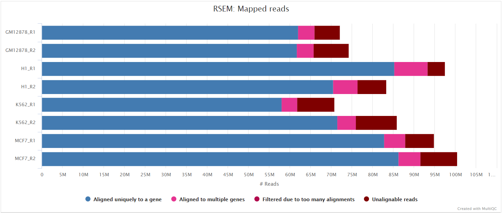
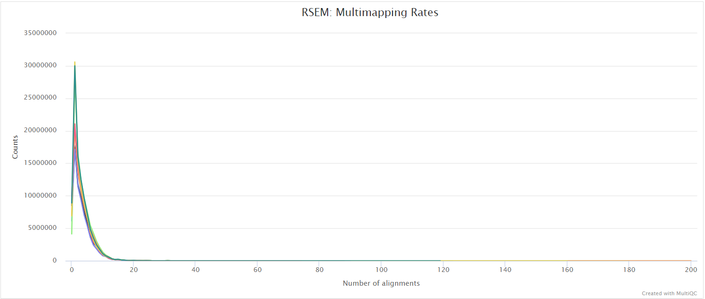
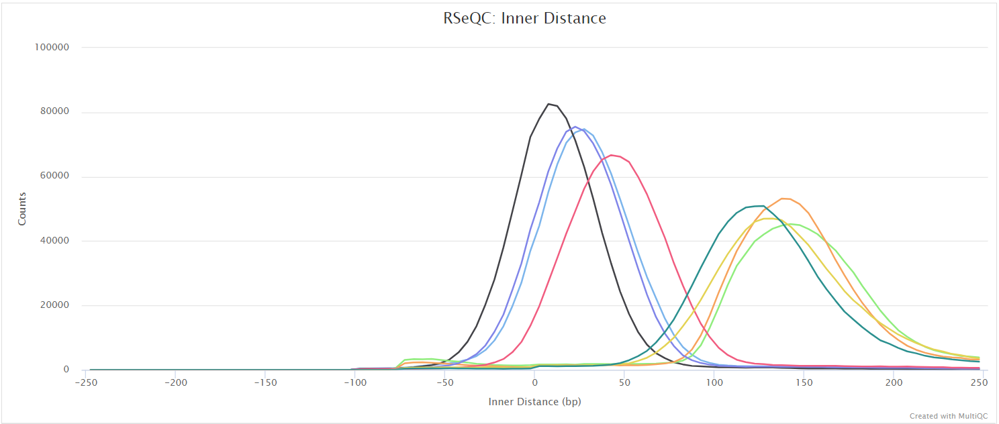
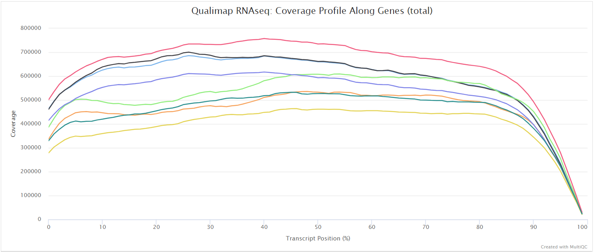
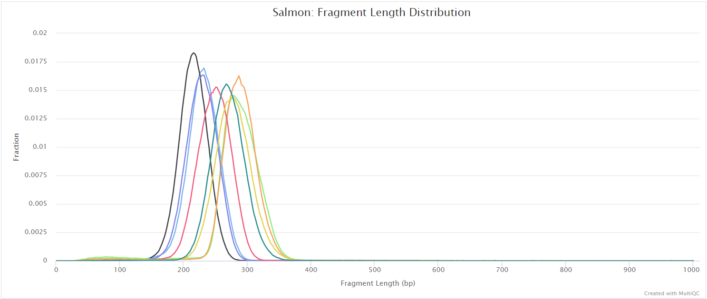

# 

This document describes the output produced by the pipeline. Most of the plots are taken from the MultiQC report generated from the [full-sized test dataset](https://github.com/nf-core/test-datasets/tree/rnaseq#full-test-dataset-origin) for the pipeline using a command similar to the one below:

```console
nextflow run nf-core/rnaseq -profile test_full,<docker/singularity/institute>
```

The directories listed below will be created in the results directory after the pipeline has finished. All paths are relative to the top-level results directory.

## Pipeline overview

The pipeline is built using [Nextflow](https://www.nextflow.io/) and processes data using the following steps:

* [Preprocessing](#preprocessing)
  * [cat](#cat) - Merge re-sequenced FastQ files
  * [FastQC](#fastqc) - Raw read QC
  * [UMI-tools extract](#umi-tools-extract) - UMI barcode extraction
  * [TrimGalore](#trimgalore) - Adapter and quality trimming
  * [SortMeRNA](#sortmerna) - Removal of ribosomal RNA
* [Alignment](#alignment)
  * [STAR](#star) - Fast spliced aware alignment to a reference
  * [STAR via RSEM](#star-via-rsem) - Alignment and quantification of expression levels
  * [HISAT2](#hisat2) - Memory efficient splice aware alignment to a reference
* [Alignment post-processing](#alignment-post-processing)
  * [SAMtools](#samtools) - Sort and index alignments
  * [UMI-tools dedup](#umi-tools-dedup) - UMI-based deduplication
  * [picard MarkDuplicates](#picard-markduplicates) - Duplicate read marking
* [Quantification](#quantification)
  * [featureCounts](#featurecounts) - Read counting relative to gene and biotype
* [Other steps](#other-steps)
  * [StringTie](#stringtie) - Transcript assembly and quantification
* [Quality control](#quality-control)
  * [RSeQC](#rseqc) - Various RNA-seq QC metrics
  * [Qualimap](#qualimap) - Various RNA-seq QC metrics
  * [dupRadar](#dupradar) - Assessment of technical / biological read duplication
  * [Preseq](#preseq) - Estimation of library complexity
  * [edgeR](#edger) - MDS plot and sample pairwise distance heatmap and dendrogram
  * [MultiQC](#multiqc) - Present QC for raw reads, alignment, read counting and sample similiarity
* [Pseudo-alignment and quantification](#pseudo-alignment-and-quantification)
  * [Salmon](#salmon) - Wicked fast gene and isoform quantification relative to the transcriptome
* [Workflow reporting and genomes](#workflow-reporting-and-genomes)
  * [Reference genome files](#reference-genome-files) - Saving reference genome indices/files
  * [Pipeline information](#pipeline-information) - Report metrics generated during the workflow execution

## Preprocessing

### cat

<details>
<summary>Output files</summary>

* `fastq/`
  * `*.merged.fastq.gz`: If `--save_merged_fastq` is specified, concatenated FastQ files will be placed in this directory.

</details>

If multiple libraries/runs have been provided for the same sample in the input samplesheet (e.g. to increase sequencing depth) then these will be merged at the very beginning of the pipeline in order to have consistent sample naming throughout the pipeline. Please refer to the [usage docs](https://nf-co.re/rnaseq/usage#introduction) to see how to specify these samples in the input samplesheet.

### FastQC

<details>
<summary>Output files</summary>

* `fastqc/`
  * `*_fastqc.html`: FastQC report containing quality metrics.
  * `*_fastqc.zip`: Zip archive containing the FastQC report, tab-delimited data file and plot images.

> **NB:** The FastQC plots in this directory are generated relative to the raw, input reads. They may contain adapter sequence and regions of low quality. To see how your reads look after adapter and quality trimming please refer to the FastQC reports in the `trimgalore/fastqc/` directory.

</details>

[FastQC](http://www.bioinformatics.babraham.ac.uk/projects/fastqc/) gives general quality metrics about your sequenced reads. It provides information about the quality score distribution across your reads, per base sequence content (%A/T/G/C), adapter contamination and overrepresented sequences. For further reading and documentation see the [FastQC help pages](http://www.bioinformatics.babraham.ac.uk/projects/fastqc/Help/).


### UMI-tools extract

<details>
<summary>Output files</summary>

* `umitools/`
  * `*.fastq.gz`: If `--save_umi_intermeds` is specified, FastQ files **after** UMI extraction will be placed in this directory.
  * `*.log`: Log file generated by the UMI-tools `extract` command.

</details>

[UMI-tools](https://github.com/CGATOxford/UMI-tools) deduplicates reads based on unique molecular identifiers (UMIs) to address PCR-bias. Firstly, the UMI-tools `extract` command removes the UMI barcode information from the read sequence and adds it to the read name. Secondly, reads are deduplicated based on UMI identifier after mapping as highlighted in the [UMI-tools dedup](#umi-tools-dedup) section.

### TrimGalore

<details>
<summary>Output files</summary>

* `trimgalore/`
  * `*.fq.gz`: If `--save_trimmed` is specified, FastQ files **after** adapter trimming will be placed in this directory.
  * `*_trimming_report.txt`: Log file generated by Trim Galore!.
* `trimgalore/fastqc/`
  * `*_fastqc.html`: FastQC report containing quality metrics for read 1 (*and read2 if paired-end*) **after** adapter trimming.
  * `*_fastqc.zip`: Zip archive containing the FastQC report, tab-delimited data file and plot images.

</details>

[Trim Galore!](https://www.bioinformatics.babraham.ac.uk/projects/trim_galore/) is a wrapper tool around Cutadapt and FastQC to peform quality and adapter trimming on FastQ files. By default, Trim Galore! will automatically detect and trim the appropriate adapter sequence. See [usage docs](https://nf-co.re/rnaseq/usage#adapter-trimming) for more details about the trimming options.


### SortMeRNA

<details>
<summary>Output files</summary>

* `sortmerna/`
  * `*.fastq.gz`: If `--save_non_ribo_reads` is specified, FastQ files containing non-rRNA reads will be placed in this directory.
  * `*.log`: Log file generated by SortMeRNA with information regarding reads that matched the reference database(s).

</details>

When `--remove_ribo_rna` is specified, the pipeline uses [SortMeRNA](https://github.com/biocore/sortmerna) for the removal of ribosomal RNA. By default, [rRNA databases](https://github.com/biocore/sortmerna/tree/master/data/rRNA_databases) defined in the SortMeRNA GitHub repo are used. You can see an example in the pipeline Github repository in `assets/rrna-default-dbs.txt` which is used by default via the `--ribo_database_manifest` parameter. Please note that commercial/non-academic entities require [`licensing for SILVA`](https://www.arb-silva.de/silva-license-information) for these default databases.

## Alignment

### STAR

<details>
<summary>Output files</summary>

* `star/`
  * `*.Aligned.out.bam`: If `--save_align_intermeds` is specified the original BAM file containing read alignments to the reference genome will be placed in this directory.
  * `*.Aligned.toTranscriptome.out.bam`: If `--save_align_intermeds` is specified the original BAM file containing read alignments to the transcriptome will be placed in this directory.
* `star/log/`
  * `*.SJ.out.tab`: File containing filtered splice junctions detected after mapping the reads.
  * `*.Log.final.out`: STAR alignment report containing the mapping results summary.
  * `*.Log.out` and `*.Log.progress.out`: STAR log files containing detailed information about the run. Typically only useful for debugging purposes.
* `star/unmapped/`
  * `*.fastq.gz`: If `--save_unaligned` is specified, FastQ files containing unmapped reads will be placed in this directory.

</details>

[STAR](https://github.com/alexdobin/STAR) is a read aligner designed for splice aware mapping typical of RNA sequencing data. STAR stands for *S*pliced *T*ranscripts *A*lignment to a *R*eference, and has been shown to have high accuracy and outperforms other aligners by more than a factor of 50 in mapping speed, but it is memory intensive. STAR is the default `--aligner` option.

The STAR section of the MultiQC report shows a bar plot with alignment rates: good samples should have most reads as _Uniquely mapped_ and few _Unmapped_ reads.


### STAR via RSEM

<details>
<summary>Output files</summary>

* `star_rsem/`
  * `rsem.merged.gene_counts.tsv`: Matrix of gene-level raw counts across all samples.
  * `rsem.merged.gene_tpm.tsv`: Matrix of gene-level TPM values across all samples.
  * `rsem.merged.transcript_counts.tsv`: Matrix of isoform-level raw counts across all samples.
  * `rsem.merged.transcript_tpm.tsv`: Matrix of isoform-level TPM values across all samples.
  * `*.genes.results`: RSEM gene-level quantification results for each sample.
  * `*.isoforms.results`: RSEM isoform-level quantification results for each sample.
  * `*.STAR.genome.bam`: If `--save_align_intermeds` is specified the original BAM file containing read alignments to the reference genome will be placed in this directory.
  * `*.transcript.bam`: If `--save_align_intermeds` is specified the original BAM file containing read alignments to the transcriptome will be placed in this directory.
* `star_rsem/<SAMPLE>.stat/`
  * `*.cnt`, `*.model`, `*.theta`: RSEM counts and statistics for each sample.
* `star_rsem/log/`
  * `*.log`: STAR alignment report containing the mapping results summary.

</details>

[RSEM](https://github.com/deweylab/RSEM) is a software package for estimating gene and isoform expression levels from RNA-seq data. It has been widely touted as one of the most accurate quantification tools for RNA-seq analysis. RSEM wraps other popular tools to map the reads to the genome (i.e. STAR, Bowtie2, HISAT2; STAR is used in this pipeline) which are then subsequently filtered relative to a transcriptome before quantifying at the gene- and isoform-level. Other advantages of using RSEM are that it performs both the alignment and quantification in a single package and its ability to effectively use ambiguously-mapping reads.

You can choose to align and quantify your data with RSEM by providing the `--aligner star_rsem` parameter.

> **NB:** Since RSEM performs the mapping as well as quantification there is no point in performing an additional quantification step with featureCounts when using `--aligner star_rsem`.





### HISAT2

<details>
<summary>Output files</summary>

* `hisat2/`
  * `<SAMPLE>.bam`: If `--save_align_intermeds` is specified the original BAM file containing read alignments to the reference genome will be placed in this directory.
* `hisat2/log/`
  * `*.log`: HISAT2 alignment report containing the mapping results summary.
* `hisat2/unmapped/`
  * `*.fastq.gz`: If `--save_unaligned` is specified, FastQ files containing unmapped reads will be placed in this directory.

</details>

[HISAT2](http://daehwankimlab.github.io/hisat2/) is a fast and sensitive alignment program for mapping next-generation sequencing reads (both DNA and RNA) to a population of human genomes as well as to a single reference genome. It introduced a new indexing scheme called a Hierarchical Graph FM index (HGFM) which when combined with several alignment strategies, enable rapid and accurate alignment of sequencing reads. The HISAT2 route through the pipeline is a good option if you have memory limitations on your compute.

You can choose to align and quantify your data with HISAT2 by providing the `--aligner hisat2` parameter.


## Alignment post-processing

The pipeline has been written in a way where all the files generated downstream of the alignment are placed in the same directory as specified by `--aligner` e.g. if `--aligner star` is specified then all the downstream results will be placed in the `star/` directory. This helps with organising the directory structure and more importantly, allows the end-user to get the results from multiple aligners by simply re-running the pipeline with a different `--aligner` option along the `-resume` parameter. It also means that results won't be overwritten when resuming the pipeline and can be used for benchmarking between alignment algorithms if required.

### SAMtools

<details>
<summary>Output files</summary>

* `<ALIGNER>/`
  * `<SAMPLE>.sorted.bam`: If `--save_align_intermeds` is specified the original coordinate sorted BAM file containing read alignments will be placed in this directory.
  * `<SAMPLE>.sorted.bam.bai`: If `--save_align_intermeds` is specified the index file for the original coordinate sorted BAM file will be placed in this directory.
* `<ALIGNER>/samtools_stats/`
  * SAMtools `<SAMPLE>.sorted.bam.flagstat`, `<SAMPLE>.sorted.bam.idxstats` and `<SAMPLE>.sorted.bam.stats` files generated from the alignment files.

</details>

The original BAM files generated by the selected alignment algorithm are further processed with [SAMtools](http://samtools.sourceforge.net/) to sort them by coordinate, for indexing, as well as to generate read mapping statistics.


### UMI-tools dedup

<details>
<summary>Output files</summary>

* `<ALIGNER>/`
  * `<SAMPLE>.umi_dedup.sorted.bam`: If `--save_umi_intermeds` is specified the UMI deduplicated, coordinate sorted BAM file containing read alignments will be placed in this directory.
  * `<SAMPLE>.umi_dedup.sorted.bam.bai`: If `--save_umi_intermeds` is specified the index file for the UMI deduplicated, coordinate sorted BAM file will be placed in this directory.
* `<ALIGNER>/umitools/`
  * `*_edit_distance.tsv`: Reports the (binned) average edit distance between the UMIs at each position.
  * `*_per_umi.tsv`: UMI-level summary statistics.
  * `*_per_umi_per_position.tsv`: Tabulates the counts for unique combinations of UMI and position.

The content of the files above is explained in more detail in the [UMI-tools documentation](https://umi-tools.readthedocs.io/en/latest/reference/dedup.html#dedup-specific-options).

</details>

After extracting the UMI information from the read sequence (see [UMI-tools extract](#umi-tools-extract)), the second step in the removal of UMI barcodes involves deduplicating the reads based on both mapping and UMI barcode information using the UMI-tools `dedup` command. This will generate a filtered BAM file after the removal of PCR duplicates.

### picard MarkDuplicates

<details>
<summary>Output files</summary>

* `<ALIGNER>/`
  * `<SAMPLE>.markdup.sorted.bam`: Coordinate sorted BAM file after duplicate marking. This is the final post-processed BAM file and so will be saved by default in the results directory.
  * `<SAMPLE>.markdup.sorted.bam.bai`: Index file for coordinate sorted BAM file after duplicate marking. This is the final post-processed BAM index file and so will be saved by default in the results directory.
* `<ALIGNER>/samtools_stats/`
  * SAMtools `<SAMPLE>.markdup.sorted.bam.flagstat`, `<SAMPLE>.markdup.sorted.bam.idxstats` and `<SAMPLE>.markdup.sorted.bam.stats` files generated from the duplicate marked alignment files.
* `<ALIGNER>/picard_metrics/`
  * `<SAMPLE>.markdup.sorted.MarkDuplicates.metrics.txt`: Metrics file from MarkDuplicates.

</details>

Unless you are using [UMIs](https://emea.illumina.com/science/sequencing-method-explorer/kits-and-arrays/umi.html) it is not possible to establish whether the fragments you have sequenced from your sample were derived via true biological duplication (i.e. sequencing independent template fragments) or as a result of PCR biases introduced during the library preparation. By default, the pipeline uses [picard MarkDuplicates](https://broadinstitute.github.io/picard/command-line-overview.html#MarkDuplicates) to *mark* the duplicate reads identified amongst the alignments to allow you to guage the overall level of duplication in your samples. However, for RNA-seq data it is not recommended to physically remove duplicate reads from the alignments (unless you are using UMIs) because you expect a significant level of true biological duplication that arises from the same fragments being sequenced from for example highly expressed genes. You can skip this step via the `--skip_markduplicates` parameter.


## Quantification

### featureCounts

<details>
<summary>Output files</summary>

* `<ALIGNER>/`
  * `featurecounts.merged.counts.tsv`: Matrix of gene-level raw counts across all samples.
* `<ALIGNER>/featurecounts/`
  * `*.featureCounts.txt`: featureCounts gene-level quantification results for each sample.
  * `*.featureCounts.txt.summary`: featureCounts summary file containing overall statistics about the counts.
* `<ALIGNER>/featurecounts/biotype/`
  * `*.featureCounts.txt`: featureCounts biotype-level quantification results for each sample.
  * `*.featureCounts.txt.summary`: featureCounts summary file containing overall statistics about the counts.
  * `*_mqc.tsv`: MultiQC custom content files used to plot biotypes in report.

</details>

[featureCounts](http://bioinf.wehi.edu.au/featureCounts/) from the [Subread](http://subread.sourceforge.net/) package is a quantification tool used to summarise the mapped read distribution over genomic features such as genes, exons, promotors, gene bodies, genomic bins and chromosomal locations. We can also use featureCounts to count overlaps with different classes of genomic features. This provides an additional QC to check which features are most abundant in the sample, and to highlight potential problems such as rRNA contamination.


## Other steps

### StringTie

<details>
<summary>Output files</summary>

* `<ALIGNER>/stringtie`
  * `*.coverage.gtf`: GTF file containing transcripts that are fully covered by reads.
  * `*.transcripts.gtf`: GTF file containing all of the assembled transcipts from StringTie.
  * `*.gene_abundance.txt`: Text file containing gene aboundances and FPKM values.  
* `<ALIGNER>/stringtie/<SAMPLE>.ballgown/`: Ballgown output directory.

</details>

[StringTie](https://ccb.jhu.edu/software/stringtie/) is a fast and highly efficient assembler of RNA-Seq alignments into potential transcripts. It uses a novel network flow algorithm as well as an optional de novo assembly step to assemble and quantitate full-length transcripts representing multiple splice variants for each gene locus. In order to identify differentially expressed genes between experiments, StringTie's output can be processed by specialized software like [Ballgown](https://github.com/alyssafrazee/ballgown), [Cuffdiff](http://cole-trapnell-lab.github.io/cufflinks/cuffdiff/index.html) or other programs ([DESeq2](https://bioconductor.org/packages/release/bioc/html/DESeq2.html), [edgeR](https://bioconductor.org/packages/release/bioc/html/edgeR.html), etc.).

## Quality control

### RSeQC

[RSeQC]((http://rseqc.sourceforge.net/)) is a package of scripts designed to evaluate the quality of RNA-seq data. This pipeline runs several, but not all RSeQC scripts. You can tweak the supported scripts you would like to run by adjusting the `--rseqc_modules` parameter which by default will run all of the following: `bam_stat.py`, `inner_distance.py`, `infer_experiment.py`, `junction_annotation.py`, `junction_saturation.py`,`read_distribution.py` and `read_duplication.py`.

The majority of RSeQC scripts generate output files which can be plotted and summarised in the MultiQC report.

#### Infer experiment

<details>
<summary>Output files</summary>

* `<ALIGNER>/rseqc/infer_experiment/`
  * `*.infer_experiment.txt`: File containing fraction of reads mapping to given strandedness configurations.

</details>

This script predicts the "strandedness" of the protocol (i.e. unstranded, sense or antisense) that was used to prepare the sample for sequencing by assessing the orientation in which aligned reads overlay gene features in the reference genome. The strandedness of each sample has to be provided to the pipeline in the input samplesheet (see [usage docs](https://nf-co.re/rnaseq/usage#introduction)). However, this information is not always available, especially for public datasets. As a result, additional features have been incorporated into this pipeline to auto-detect whether you have provided the correct information in the samplesheet, and if this is not the case then a warning table will be placed at the top of the MultiQC report highlighting the offending samples. If required, this will allow you to correct the input samplesheet and rerun the pipeline with the accurate strand information. Note, it is important to get this information right because it can affect the final results.

RSeQC documentation: [infer_experiment.py](http://rseqc.sourceforge.net/#infer-experiment-py)

The MultiQC image below shows samples that were prepared using an antisense stranded protocol:


#### Read distribution

<details>
<summary>Output files</summary>

* `<ALIGNER>/rseqc/read_distribution/`
  * `*.read_distribution.txt`: File containing fraction of reads mapping to genome feature e.g. CDS exon, 5’UTR exon, 3’ UTR exon, Intron, Intergenic regions etc.

</details>

This tool calculates how mapped reads are distributed over genomic features. A good result for a standard RNA-seq experiments is generally to have as many exonic reads as possible (`CDS_Exons`). A large amount of intronic reads could be indicative of DNA contamination in your sample but may be expected for a total RNA preparation.

RSeQC documentation: [read_distribution.py](http://rseqc.sourceforge.net/#read-distribution-py)


#### Junction annotation

<details>
<summary>Output files</summary>

* `<ALIGNER>/rseqc/junction_annotation/bed/`
  * `*.junction.bed`: BED file containing splice junctions.
  * `*.junction.Interact.bed`: BED file containing interacting splice junctions.
* `<ALIGNER>/rseqc/junction_annotation/log/`
  * `*.junction_annotation.log`: Log file generated by the program.
* `<ALIGNER>/rseqc/junction_annotation/pdf/`
  * `*.splice_events.pdf`: PDF file containing splicing events plot.
  * `*.splice_junction.pdf`: PDF file containing splice junctions plot.
* `<ALIGNER>/rseqc/junction_annotation/rscript/`
  * `*.junction_plot.r`: R script used to generate pdf plots above.
* `<ALIGNER>/rseqc/junction_annotation/xls/`
  * `*.junction.xls`: Excel spreadsheet with junction information.

</details>

Junction annotation compares detected splice junctions to a reference gene model. Splicing annotation is performed in two levels: splice event level and splice junction level.

RSeQC documentation: [junction_annotation.py](http://rseqc.sourceforge.net/#junction-annotation-py)


#### Inner distance

<details>
<summary>Output files</summary>

* `<ALIGNER>/rseqc/inner_distance/pdf/`
  * `*.inner_distance_plot.pdf`: PDF file containing inner distance plot.
* `<ALIGNER>/rseqc/inner_distance/rscript/`
  * `*.inner_distance_plot.r`: R script used to generate pdf plot above.
* `<ALIGNER>/rseqc/inner_distance/txt/`
  * `*.inner_distance_freq.txt`: File containing frequency of insert sizes.
  * `*.inner_distance_mean.txt`: File containing mean, median and standard deviation of insert sizes.

</details>

The inner distance script tries to calculate the inner distance between two paired-end reads. It is the distance between the end of read 1 to the start of read 2, and it is sometimes confused with the insert size (see [this blog post](http://thegenomefactory.blogspot.com.au/2013/08/paired-end-read-confusion-library.html) for disambiguation):

This plot will not be generated for single-end data. Very short inner distances are often seen in old or degraded samples (_eg._ FFPE) and values can be negative if the reads overlap consistently.

RSeQC documentation: [inner_distance.py](http://rseqc.sourceforge.net/#inner-distance-py)



#### Junction saturation

<details>
<summary>Output files</summary>

* `<ALIGNER>/rseqc/junction_saturation/pdf/`
  * `*.junctionSaturation_plot.pdf`: PDF file containing junction saturation plot.
* `<ALIGNER>/rseqc/junction_saturation/rscript/`
  * `*.junctionSaturation_plot.r`: R script used to generate pdf plot above.

</details>

This script shows the number of splice sites detected within the data at various levels of subsampling. A sample that reaches a plateau before getting to 100% data indicates that all junctions in the library have been detected, and that further sequencing will not yield any more observations. A good sample should approach such a plateau of _Known junctions_, however, very deep sequencing is typically required to saturate all _Novel Junctions_ in a sample.

RSeQC documentation: [junction_saturation.py](http://rseqc.sourceforge.net/#junction-saturation-py)


#### Read duplication

<details>
<summary>Output files</summary>

* `<ALIGNER>/rseqc/read_duplication/pdf/`
  * `*.DupRate_plot.pdf`: PDF file containing read duplication plot.
* `<ALIGNER>/rseqc/read_duplication/rscript/`
  * `*.DupRate_plot.r`: R script used to generate pdf plot above.
* `<ALIGNER>/rseqc/read_duplication/xls/`
  * `*.pos.DupRate.xls`: Read duplication rate determined from mapping position of read. First column is “occurrence” or duplication times, second column is number of uniquely mapped reads.
  * `*.seq.DupRate.xls`: Read duplication rate determined from sequence of read. First column is “occurrence” or duplication times, second column is number of uniquely mapped reads.

</details>

This plot shows the number of reads (y-axis) with a given number of exact duplicates (x-axis). Most reads in an RNA-seq library should have a low number of exact duplicates. Samples which have many reads with many duplicates (a large area under the curve) may be suffering excessive technical duplication.

RSeQC documentation: [read_duplication.py](http://rseqc.sourceforge.net/#read-duplication-py)


#### BAM stat

<details>
<summary>Output files</summary>

* `<ALIGNER>/rseqc/bam_stat/`
  * `*.bam_stat.txt`: Mapping statistics for the BAM file.

</details>

This script gives numerous statistics about the aligned BAM files. A typical output looks as follows:

```txt
#Output (all numbers are read count)
#==================================================
Total records:                                 41465027
QC failed:                                     0
Optical/PCR duplicate:                         0
Non Primary Hits                               8720455
Unmapped reads:                                0

mapq < mapq_cut (non-unique):                  3127757
mapq >= mapq_cut (unique):                     29616815
Read-1:                                        14841738
Read-2:                                        14775077
Reads map to '+':                              14805391
Reads map to '-':                              14811424
Non-splice reads:                              25455360
Splice reads:                                  4161455
Reads mapped in proper pairs:                  21856264
Proper-paired reads map to different chrom:    7648
```

MultiQC plots each of these statistics in a dot plot. Each sample in the project is a dot - hover to see the sample highlighted across all fields.

RSeQC documentation: [bam_stat.py](http://rseqc.sourceforge.net/#bam-stat-py)

### Qualimap

<details>
<summary>Output files</summary>

* `<ALIGNER>/qualimap/<SAMPLE>/`
  * `qualimapReport.html`: Qualimap HTML report that can be viewed in a web browser.
  * `rnaseq_qc_results.txt`: Textual results output.
* `<ALIGNER>/qualimap/<SAMPLE>/images_qualimapReport/`: Images required for the HTML report.
* `<ALIGNER>/qualimap/<SAMPLE>/raw_data_qualimapReport/`: Raw data required for the HTML report.
* `<ALIGNER>/qualimap/<SAMPLE>/css/`: CSS files required for the HTML report.

</details>

[Qualimap](http://qualimap.bioinfo.cipf.es/) is a platform-independent application written in Java and R that provides both a Graphical User Interface (GUI) and a command-line interface to facilitate the quality control of alignment sequencing data. Shortly, Qualimap:

* Examines sequencing alignment data according to the features of the mapped reads and their genomic properties.
* Provides an overall view of the data that helps to to the detect biases in the sequencing and/or mapping of the data and eases decision-making for further analysis.

The [Qualimap RNA-seq QC module](http://qualimap.bioinfo.cipf.es/doc_html/analysis.html#rna-seq-qc) is used within this pipeline to assess the overall mapping and coverage relative to gene features.




### dupRadar

<details>
<summary>Output files</summary>

* `<ALIGNER>/dupradar/box_plot/`
  * `*_duprateExpBoxplot.pdf`: PDF file containing box plot for duplicate rate relative to mean expression.
* `<ALIGNER>/dupradar/gene_data/`
  * `*_dupMatrix.txt`: Text file containing duplicate metrics per gene.
* `<ALIGNER>/dupradar/histogram/`
  * `*_expressionHist.pdf`: PDF file containing histogram of reads per kilobase values per gene.
* `<ALIGNER>/dupradar/intercepts_slope/`
  * `*_intercept_slope.txt`: Text file containing intercept slope values.
* `<ALIGNER>/dupradar/scatter_plot/`
  * `*_duprateExpDens.pdf`: PDF file containing typical dupRadar 2D density scatter plot.

See [dupRadar docs](https://www.bioconductor.org/packages/devel/bioc/vignettes/dupRadar/inst/doc/dupRadar.html) for further information regarding the content of these files.

</details>

[dupRadar](https://www.bioconductor.org/packages/release/bioc/html/dupRadar.html) is a Bioconductor library written in the R programming language. It generates various QC metrics and plots that relate duplication rate with gene expression levels in order to identify experiments with high technical duplication. A good sample with little technical duplication will only show high numbers of duplicates for highly expressed genes. Samples with technical duplication will have high duplication for all genes, irrespective of transcription level.


> _Credit: [dupRadar documentation](https://www.bioconductor.org/packages/devel/bioc/vignettes/dupRadar/inst/doc/dupRadar.html)_

### Preseq

<details>
<summary>Output files</summary>

* `<ALIGNER>/preseq/`
  * `*.ccurve.txt`: Preseq expected future yield file.
* `<ALIGNER>/preseq/log/`
  * `*.command.log`: Standard error output from command.

</details>

The [Preseq](http://smithlabresearch.org/software/preseq/) package is aimed at predicting and estimating the complexity of a genomic sequencing library, equivalent to predicting and estimating the number of redundant reads from a given sequencing depth and how many will be expected from additional sequencing using an initial sequencing experiment. The estimates can then be used to examine the utility of further sequencing, optimize the sequencing depth, or to screen multiple libraries to avoid low complexity samples. A shallow curve indicates that the library has reached complexity saturation and further sequencing would likely not add further unique reads. The dashed line shows a perfectly complex library where total reads = unique reads. Note that these are predictive numbers only, not absolute. The MultiQC plot can sometimes give extreme sequencing depth on the X axis - click and drag from the left side of the plot to zoom in on more realistic numbers.


### edgeR

<details>
<summary>Output files</summary>

* `<ALIGNER>/edger_correlation/`
  * `edger_mds_aplot_coordinates_mqc.csv`: Scatter plot coordinates from MDS plot, used in the MultiQC report.
  * `edger_mds_distance_matrix.csv`: Distance matrix containing raw data from the MDS analysis.
  * `edger_mds_plot.pdf`: MDS scatter plot showing sample similarity.
  * `log2cpm_sample_correlation_heatmap.pdf`: Heatmap showing the Pearsons correlation between your samples.
  * `log2cpm_sample_correlation_mqc.csv`: Raw data from the Pearsons correlation heatmap, used in the MultiQC report.
  * `log2cpm_sample_distances_dendrogram.pdf`: Dendrogram showing the Euclidean distance between your samples.

</details>

[edgeR](https://bioconductor.org/packages/release/bioc/html/edgeR.html) is a Bioconductor package written in the R programming language and used for RNA-seq data analysis. The script included in the pipeline uses edgeR to normalise read counts and to create a heatmap showing Pearson's correlation and a dendrogram showing pairwise Euclidean distances between the samples in the experiment. It also creates a 2D MDS scatter plot showing sample grouping. These help to show the similarity between groups of samples and can reveal batch effects and other potential issues with the experiment.


### MultiQC

<details>
<summary>Output files</summary>

* `multiqc/<ALIGNER>/`  
  * `multiqc_report.html`: a standalone HTML file that can be viewed in your web browser.
  * `multiqc_data/`: directory containing parsed statistics from the different tools used in the pipeline.
  * `multiqc_plots/`: directory containing static images from the report in various formats.

</details>

[MultiQC](http://multiqc.info) is a visualization tool that generates a single HTML report summarising all samples in your project. Most of the pipeline QC results are visualised in the report and further statistics are available in the report data directory.

Results generated by MultiQC collate pipeline QC from supported tools i.e. FastQC, Cutadapt, SortMeRNA, STAR, RSEM, HISAT2, Salmon, SAMtools, Picard, RSeQC, Qualimap, Preseq and featureCounts. Additionally, various custom content has been added to the report to assess the output of dupRadar, edgeR and featureCounts biotypes, and to highlight samples failing a mimimum mapping threshold or those that failed to match the strand-specificity provided in the input samplesheet. The pipeline has special steps which also allow the software versions to be reported in the MultiQC output for future traceability. For more information about how to use MultiQC reports, see <http://multiqc.info>.

## Pseudo-alignment and quantification

### Salmon

<details>
<summary>Output files</summary>

* `salmon/`
  * `salmon.merged.gene_counts.tsv`: Matrix of gene-level raw counts across all samples.
  * `salmon.merged.gene_tpm.tsv`: Matrix of gene-level TPM values across all samples.
  * `salmon.merged.gene_counts.rds`: RDS object that can be loaded in R that contains a [SummarizedExperiment](https://bioconductor.org/packages/release/bioc/html/SummarizedExperiment.html) container with the TPM (`abundance`), estimated counts (`counts`) and transcript length (`length`) in the assays slot for genes.
  * `salmon.merged.transcript_counts.tsv`: Matrix of isoform-level raw counts across all samples.
  * `salmon.merged.transcript_tpm.tsv`: Matrix of isoform-level TPM values across all samples.
  * `salmon.merged.transcript_counts.rds`: RDS object that can be loaded in R that contains a [SummarizedExperiment](https://bioconductor.org/packages/release/bioc/html/SummarizedExperiment.html) container with the TPM (`abundance`), estimated counts (`counts`) and transcript length (`length`) in the assays slot for transcripts.
* `salmon/<SAMPLE>/`
  * `aux_info/`: Auxiliary info e.g. versions and number of mapped reads.
  * `cmd_info.json`: Information about the Salmon quantification command, version and options.
  * `lib_format_counts.json`: Number of fragments assigned, unassigned and incompatible.
  * `libParams/`: Contains the file `flenDist.txt` for the fragment length distribution.
  * `logs/`: Contains the file `salmon_quant.log` giving a record of Salmon's quantification.
  * `quant.genes.sf`: Salmon _gene_-level quantification of the sample, including feature length, effective length, TPM, and number of reads.
  * `quant.sf`: Salmon _transcript_-level quantification of the sample, including feature length, effective length, TPM, and number of reads.
  * `<SAMPLE>.salmon.gene_counts.tsv`: Subset of `quant.genes.sf`, only containing the gene id and raw counts.
  * `<SAMPLE>.salmon.gene_tpm.tsv`: Subset of `quant.genes.sf`, only containing the gene id and TPM values.
  * `<SAMPLE>.salmon.transcript_counts.tsv`: Subset of `quant.sf`, only containing the transcript id and raw counts.
  * `<SAMPLE>.salmon.transcript_tpm.tsv`: Subset of `quant.sf`, only containing the transcript id and TPM values.

</details>

[Salmon](https://salmon.readthedocs.io/en/latest/salmon.html) from [Ocean Genomics](https://oceangenomics.com/) is a tool for wicked-fast transcript quantification from RNA-seq data. It requires a set of target transcripts (either from a reference or de-novo assembly) to quantify. All you need to run Salmon is a FASTA file containing your reference transcripts and a (set of) FASTA/FASTQ file(s) containing your reads.

The [tximport](https://bioconductor.org/packages/release/bioc/html/tximport.html) package is used in this pipeline to summarise the results generated by Salmon into matrices for use with downstream gene-level analysis packages i.e. transcript-level abundances, estimated counts and transcript lengths. Average transcript length, weighted by sample-specific transcript abundance estimates, is provided as a matrix which can be used as an offset for differential expression of gene-level counts.

You can choose to pseudo-align and quantify your data with Salmon by providing the `--pseudo_aligner salmon` parameter. By default, Salmon is run in addition to the standard alignment workflow defined by `--aligner`, mainly because it allows you to obtain QC metrics with respect to the genomic alignments. However, you can provide the `--skip_alignment` parameter if you would like to run Salmon in isolation.

> **NB:** The default Salmon parameters and a k-mer size of 31 are used to create the index. As [discussed here](https://salmon.readthedocs.io/en/latest/salmon.html#preparing-transcriptome-indices-mapping-based-mode)), a k-mer size off 31 works well with reads that are 75bp or longer.



## Workflow reporting and genomes

### Reference genome files

<details>
<summary>Output files</summary>

* `genome/`  
  * `*.fa`, `*.gtf`, `*.gff`, `*.bed`, `.tsv`: If the `--save_reference` parameter is provided then all of the genome reference files will be placed in this directory.
* `genome/index/`  
  * `star/`: Directory containing STAR indices.
  * `hisat2/`: Directory containing HISAT2 indices.
  * `rsem/`: Directory containing STAR and RSEM indices.
  * `salmon/`: Directory containing Salmon indices.

</details>

A number of genome-specific files are generated by the pipeline because they are required for the downstream processing of the results. If the `--save_reference` parameter is provided then these will be saved in the `genome/` directory. It is recommended to use the `--save_reference` parameter if you are using the pipeline to build new indices so that you can save them somewhere locally. The index building step can be quite a time-consuming process and it permits their reuse for future runs of the pipeline to save disk space.

### Pipeline information

<details>
<summary>Output files</summary>

* `pipeline_info/`
  * Reports generated by Nextflow: `execution_report.html`, `execution_timeline.html`, `execution_trace.txt` and `pipeline_dag.dot`/`pipeline_dag.svg`.
  * Reports generated by the pipeline: `pipeline_report.html`, `pipeline_report.txt` and `software_versions.csv`.
  * Reformatted samplesheet files used as input to the pipeline: `samplesheet.valid.csv`.

</details>

[Nextflow](https://www.nextflow.io/docs/latest/tracing.html) provides excellent functionality for generating various reports relevant to the running and execution of the pipeline. This will allow you to troubleshoot errors with the running of the pipeline, and also provide you with other information such as launch commands, run times and resource usage.
